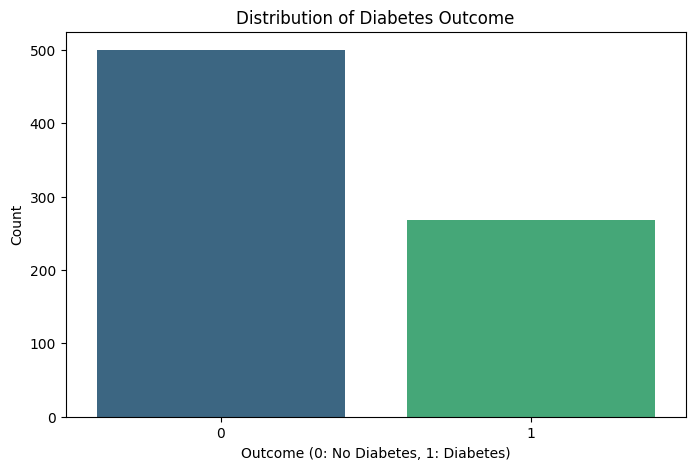
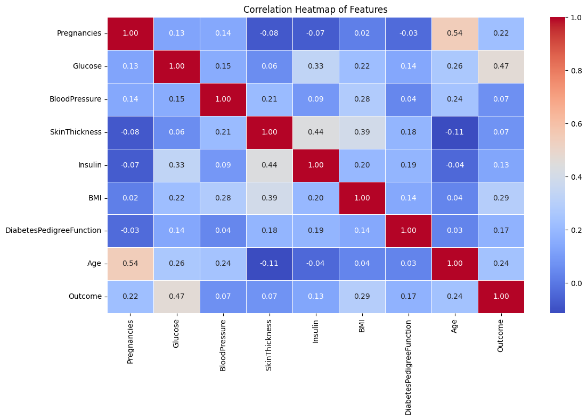
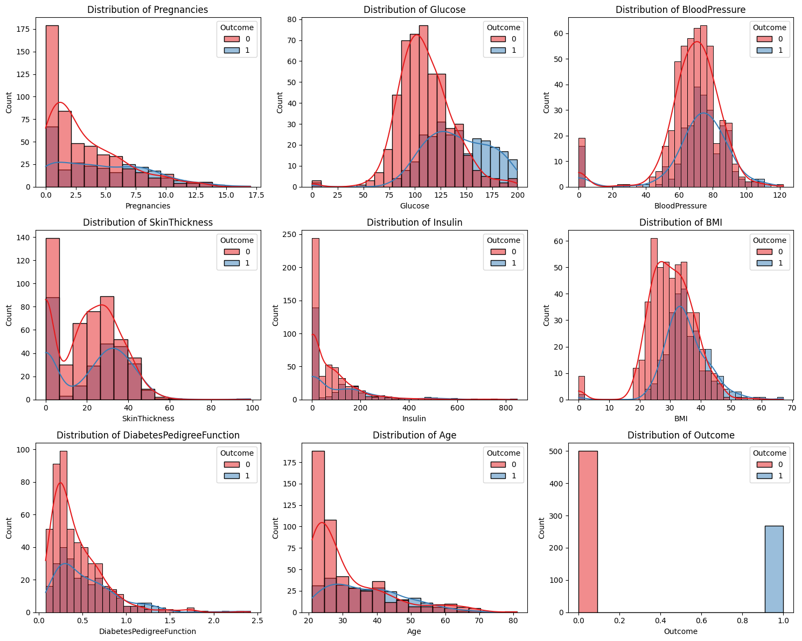
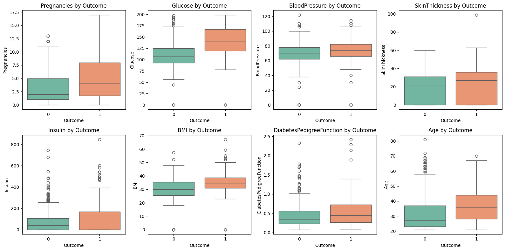
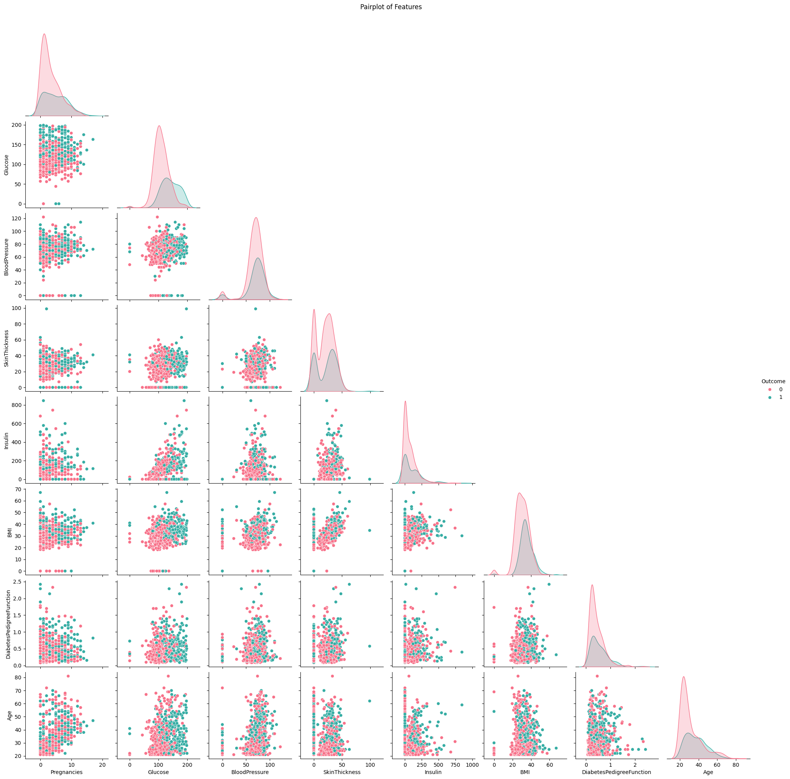
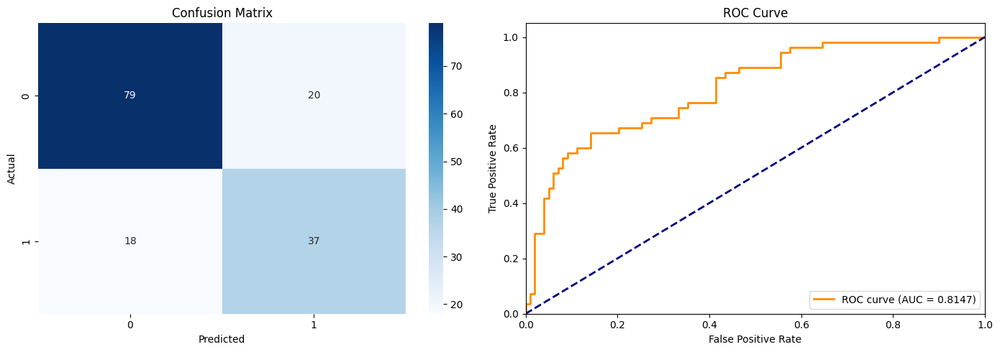
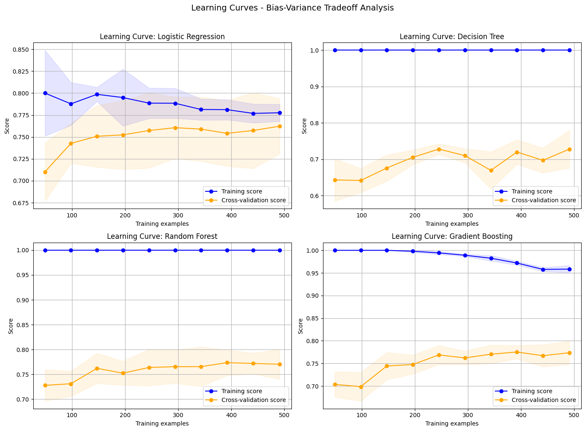
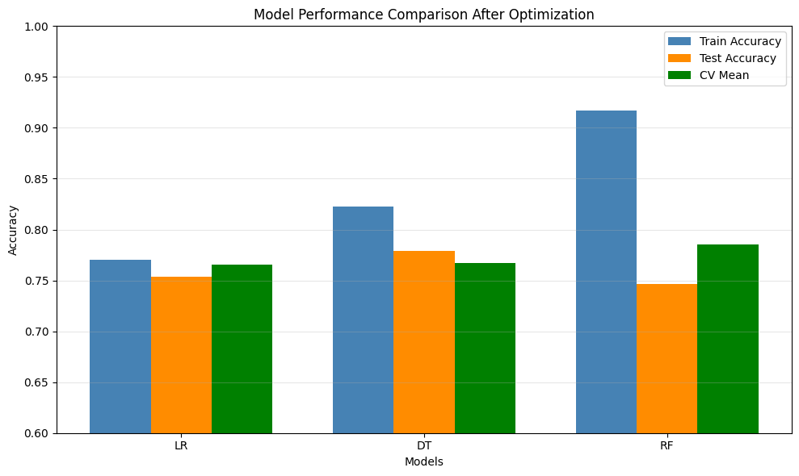
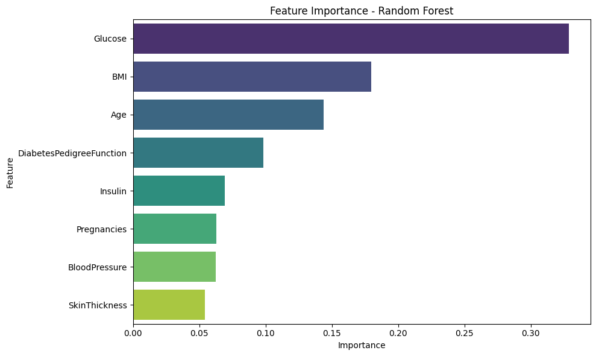
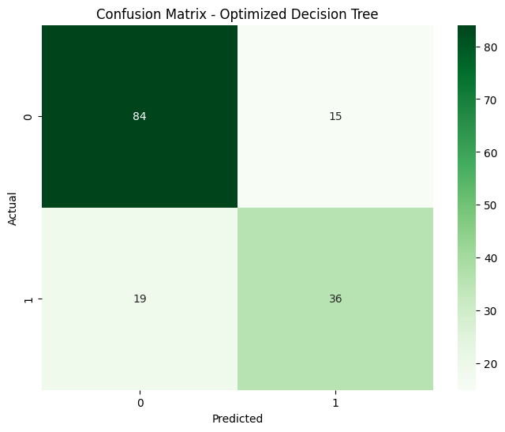

# Bias-Variance Analysis on the Pima Indians Diabetes Dataset

[](https://www.python.org/)
[](https://scikit-learn.org/)
[](https://pandas.pydata.org/)
[](https://jupyter.org/)
[](#license)
[](#contributing)

A hands-on study of the **bias–variance tradeoff** on the Pima Indians Diabetes
dataset. Five classifiers (Logistic Regression, Decision Tree, Random Forest,
Gradient Boosting, SVM) are trained, diagnosed for underfitting / overfitting,
visualised with learning curves, and then tuned with `GridSearchCV` to land at
a healthier point on the bias–variance curve.

> 🏆 **Best model:** **Optimized Decision Tree** — **0.7792** test accuracy
> (`max_depth=5`, `min_samples_leaf=10`). Trading a bit of variance for
> substantially better generalization is the clearest win in this study.

---

## Table of Contents

- [Overview](#overview)
- [Dataset](#dataset)
- [Project Structure](#project-structure)
- [Installation](#installation)
- [Usage](#usage)
  - [1. Load & Split the Data](#1-load--split-the-data)
  - [2. Train a Baseline Logistic Regression](#2-train-a-baseline-logistic-regression)
  - [3. Run the Bias–Variance Diagnostic](#3-run-the-biasvariance-diagnostic)
  - [4. Tune Models with GridSearchCV](#4-tune-models-with-gridsearchcv)
  - [5. Plot Learning Curves](#5-plot-learning-curves)
- [Exploratory Data Analysis](#exploratory-data-analysis)
- [Baseline Model — Logistic Regression](#baseline-model--logistic-regression)
- [Bias–Variance Diagnostic](#biasvariance-diagnostic)
- [Model Optimization & Comparison](#model-optimization--comparison)
- [Feature Importance](#feature-importance)
- [🏆 Best Model & Final Predictions](#-best-model--final-predictions)
- [Key Takeaways](#key-takeaways)
- [Contributing](#contributing)
- [License](#license)

---

## Overview

The notebook (`diabetes.ipynb`) is organized into five sections that mirror a
realistic ML workflow:

1. **Data Exploration & Visualization** — shape, summary stats, class balance,
   correlation heatmap, per-feature distributions, outlier detection, pairplot.
2. **Model Training & Prediction** — scaled features, baseline Logistic
   Regression, confusion matrix, ROC/AUC.
3. **Bias–Variance Analysis** — quantifies bias (`1 - train_score`) and variance
   (`std` of CV scores) across five models and flags each as underfitting,
   overfitting, or balanced.
4. **Model Adjustment & Optimization** — `GridSearchCV` over regularization
   strength, tree depth, leaf size, ensemble size, etc.
5. **Final Predictions & Summary** — picks the best model by test accuracy and
   prints a written summary of the tradeoff.

## Dataset

| Property | Value |
| --- | --- |
| Source | Pima Indians Diabetes Database |
| Rows | 768 |
| Features | 8 numerical (Pregnancies, Glucose, BloodPressure, SkinThickness, Insulin, BMI, DiabetesPedigreeFunction, Age) |
| Target | `Outcome` (0 = no diabetes, 1 = diabetes) |
| Class balance | ~65% negative / ~35% positive |

## Project Structure

```
Bias-Variance-Analysis/
├── diabetes.ipynb        # Main analysis notebook
├── diabetes.csv          # Pima Indians Diabetes dataset
├── images/               # Rendered charts used in this README
├── requirements.txt      # Python dependencies
├── LICENSE               # MIT license
└── README.md             # This file
```

## Installation

```bash
git clone https://github.com/pareekarnav16/-Bias-Variance-Analysis.git
cd -Bias-Variance-Analysis

python -m venv .venv
# Windows
.venv\Scripts\activate
# macOS / Linux
source .venv/bin/activate

pip install -r requirements.txt
```

Minimum dependencies:

```text
pandas>=2.0
numpy>=1.24
scikit-learn>=1.3
matplotlib>=3.7
seaborn>=0.12
jupyter>=1.0
```

Launch the notebook:

```bash
jupyter notebook diabetes.ipynb
```

## Usage

The snippets below mirror the notebook so you can paste them into a fresh
script or REPL.

### 1. Load & Split the Data

```python
import pandas as pd
from sklearn.model_selection import train_test_split

data = pd.read_csv("diabetes.csv")
X = data.drop("Outcome", axis=1)
y = data["Outcome"]

X_train, X_test, y_train, y_test = train_test_split(
    X, y, test_size=0.2, random_state=42
)
```

### 2. Train a Baseline Logistic Regression

```python
from sklearn.preprocessing import StandardScaler
from sklearn.linear_model import LogisticRegression
from sklearn.metrics import accuracy_score, classification_report

scaler = StandardScaler()
X_train_scaled = scaler.fit_transform(X_train)
X_test_scaled  = scaler.transform(X_test)

lr = LogisticRegression(max_iter=1000, random_state=42)
lr.fit(X_train_scaled, y_train)

y_pred = lr.predict(X_test_scaled)
print(f"Accuracy: {accuracy_score(y_test, y_pred):.4f}")
print(classification_report(y_test, y_pred))
```

### 3. Run the Bias–Variance Diagnostic

```python
from sklearn.model_selection import cross_val_score
from sklearn.tree import DecisionTreeClassifier
from sklearn.ensemble import RandomForestClassifier, GradientBoostingClassifier
from sklearn.svm import SVC

def diagnose(model, X_tr, X_te, y_tr, y_te, name):
    model.fit(X_tr, y_tr)
    train = model.score(X_tr, y_tr)
    test  = model.score(X_te, y_te)
    cv    = cross_val_score(model, X_tr, y_tr, cv=5)

    bias     = 1 - train
    variance = cv.std()

    print(f"{name:>20s} | train={train:.3f} test={test:.3f} "
          f"bias={bias:.3f} variance={variance:.3f}")

models = {
    "Logistic Regression": LogisticRegression(max_iter=1000, random_state=42),
    "Decision Tree":       DecisionTreeClassifier(random_state=42),
    "Random Forest":       RandomForestClassifier(n_estimators=100, random_state=42),
    "Gradient Boosting":   GradientBoostingClassifier(n_estimators=100, random_state=42),
    "SVM":                 SVC(random_state=42),
}

for name, m in models.items():
    diagnose(m, X_train_scaled, X_test_scaled, y_train, y_test, name)
```

### 4. Tune Models with GridSearchCV

```python
from sklearn.model_selection import GridSearchCV

dt_params = {
    "max_depth":         [3, 5, 7, 10, None],
    "min_samples_split": [2, 5, 10, 20],
    "min_samples_leaf":  [1, 2, 5, 10],
}

dt_grid = GridSearchCV(
    DecisionTreeClassifier(random_state=42),
    dt_params, cv=5, scoring="accuracy", n_jobs=-1,
)
dt_grid.fit(X_train_scaled, y_train)

print("Best params:", dt_grid.best_params_)
print(f"Best CV:    {dt_grid.best_score_:.4f}")
print(f"Test:       {dt_grid.score(X_test_scaled, y_test):.4f}")
```

### 5. Plot Learning Curves

```python
import numpy as np
import matplotlib.pyplot as plt
from sklearn.model_selection import learning_curve

train_sizes, train_scores, test_scores = learning_curve(
    dt_grid.best_estimator_, X_train_scaled, y_train,
    cv=5, n_jobs=-1, train_sizes=np.linspace(0.1, 1.0, 10),
)

plt.plot(train_sizes, train_scores.mean(axis=1), "o-", label="Train")
plt.plot(train_sizes, test_scores.mean(axis=1),  "o-", label="CV")
plt.xlabel("Training examples"); plt.ylabel("Accuracy")
plt.title("Learning Curve — Tuned Decision Tree")
plt.legend(); plt.grid(True); plt.show()
```

---

## Exploratory Data Analysis

### Class Distribution



**Insight.** The dataset is **imbalanced** — roughly 500 negative cases vs.
268 positives (~65 / 35 split). Accuracy alone is misleading on a split like
this, so precision/recall/F1 and the confusion matrix matter more than raw
accuracy.

### Correlation Heatmap



**Insight.** `Glucose` is the single strongest correlate of `Outcome`
(≈ 0.47), followed by `BMI` and `Age`. No two predictors are dangerously
collinear (all pairwise |r| ≲ 0.55), so we keep every feature.

### Feature Distributions by Outcome



**Insight.** Diabetic and non-diabetic distributions overlap heavily on
`BloodPressure` and `SkinThickness` but separate cleanly on `Glucose` and
`BMI` — those will be the most useful signals for any classifier. The spike
at zero in `Insulin` and `SkinThickness` is **encoded missingness**, not real
zeros.

### Boxplots by Outcome



**Insight.** Diabetic patients show consistently higher medians for
`Glucose`, `BMI`, `Insulin`, and `Age`. Outliers in `Insulin` and
`SkinThickness` are extreme — tree-based models will tolerate them, but
distance-based models (SVM, kNN) benefit from the standard scaling we apply.

### Pairplot



**Insight.** No single feature pair gives linear separation, so a linear
model alone will not get us far — confirmed below when Logistic Regression
shows high bias.

---

## Baseline Model — Logistic Regression



**Insight.**
- Baseline test accuracy = **0.7532**, AUC ≈ **0.81**.
- Class-1 recall is only **0.67** — the model misses a third of diabetic
  patients. In a clinical setting this is the metric that matters most, and
  it is the lever we want optimization to move.

---

## Bias–Variance Diagnostic

Numbers from the notebook (untuned baselines, `test_size=0.2`, `random_state=42`):

| Model | Train Acc | Test Acc | CV Mean | Bias | Variance | Diagnosis |
| --- | ---: | ---: | ---: | ---: | ---: | --- |
| Logistic Regression | 0.7704 | 0.7532 | 0.7606 | 0.230 | 0.030 | **High bias** (underfit) |
| Decision Tree | 1.0000 | 0.7468 | 0.7198 | 0.000 | 0.052 | **High variance** (overfit) |
| Random Forest | 1.0000 | 0.7208 | 0.7753 | 0.000 | 0.034 | Overfits training set |
| Gradient Boosting | 0.9381 | 0.7403 | 0.7704 | 0.062 | 0.024 | Balanced |
| SVM | 0.8339 | 0.7338 | 0.7687 | 0.166 | 0.024 | Slight bias |

### Learning Curves



**How to read them.**
- **Logistic Regression** — train and CV curves converge low (~0.77). Classic
  **underfitting** signature → fix with richer features or weaker regularization.
- **Decision Tree** — train sits at 1.00, CV plateaus near 0.72, with a wide
  gap. Classic **overfitting** signature → fix with pruning.
- **Random Forest / Gradient Boosting** — gap narrows as data grows, CV
  climbing toward 0.78. Ensembles are the closest to a "good fit" out of the box.

---

## Model Optimization & Comparison

After `GridSearchCV` tuning:

| Model | Train Acc | Test Acc | CV Mean | Train–Test Gap |
| --- | ---: | ---: | ---: | ---: |
| Optimized Logistic Regression | 0.7704 | 0.7532 | 0.7655 | 0.017 |
| **Optimized Decision Tree** | **0.8062** | **0.7792** | **0.7671** | **0.027** |
| Optimized Random Forest | 0.8550 | 0.7468 | 0.7851 | 0.108 |



**Insight.** Pruning the Decision Tree (`max_depth=5`, `min_samples_leaf=10`)
collapsed the train–test gap from **0.25 → 0.03** while *raising* test
accuracy from 0.7468 to 0.7792. That is the textbook bias–variance win.

---

## Feature Importance



**Insight.** Across the tuned Random Forest, `Glucose` dominates importance
(≈ 0.27), followed by `BMI` and `Age`. `SkinThickness` and `BloodPressure`
contribute the least — a candidate set for any future feature-selection pass.

---

## 🏆 Best Model & Final Predictions

The **Optimized Decision Tree** wins on test accuracy and has the smallest
train–test gap of any tuned model — meaning it generalizes best.

| Metric | Value |
| --- | ---: |
| Best model | **Optimized Decision Tree** |
| Hyperparameters | `max_depth=5`, `min_samples_split=2`, `min_samples_leaf=10` |
| Test accuracy | **0.7792** |
| 5-fold CV mean | 0.7671 |
| Train–test gap | 0.027 |



**Insight.** Errors are now distributed more symmetrically across the two
classes than in the Logistic Regression baseline — the tuned tree recovers
true positives that the linear baseline missed, which is the clinically
relevant gain.

---

## Key Takeaways

- **High train, low test** is the signature of variance — fix it with
  regularization, pruning, or more data.
- **Low train and low test** is bias — fix it by adding features or relaxing
  regularization.
- Ensembles (Random Forest, Gradient Boosting) sit closer to the sweet spot
  out of the box, but a well-pruned single Decision Tree can beat them on
  small, structured datasets like this one.
- Learning curves are the single best visual diagnostic — converged curves at
  a high score mean you are done.

## Contributing

PRs and issues are welcome. If you spot a bug, want to add another classifier,
or improve the plots, open an issue first so we can align on scope.

## License

This project is released under the [MIT License](LICENSE).

```
MIT License

Copyright (c) 2026 Arnav Pareek

Permission is hereby granted, free of charge, to any person obtaining a copy
of this software and associated documentation files (the "Software"), to deal
in the Software without restriction, including without limitation the rights
to use, copy, modify, merge, publish, distribute, sublicense, and/or sell
copies of the Software, and to permit persons to whom the Software is
furnished to do so, subject to the following conditions:

The above copyright notice and this permission notice shall be included in all
copies or substantial portions of the Software.

THE SOFTWARE IS PROVIDED "AS IS", WITHOUT WARRANTY OF ANY KIND, EXPRESS OR
IMPLIED, INCLUDING BUT NOT LIMITED TO THE WARRANTIES OF MERCHANTABILITY,
FITNESS FOR A PARTICULAR PURPOSE AND NONINFRINGEMENT. IN NO EVENT SHALL THE
AUTHORS OR COPYRIGHT HOLDERS BE LIABLE FOR ANY CLAIM, DAMAGES OR OTHER
LIABILITY, WHETHER IN AN ACTION OF CONTRACT, TORT OR OTHERWISE, ARISING FROM,
OUT OF OR IN CONNECTION WITH THE SOFTWARE OR THE USE OR OTHER DEALINGS IN THE
SOFTWARE.
```
